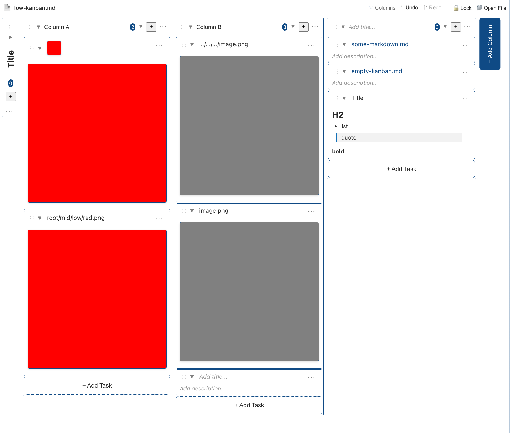

# Kanban Markdown for Visual Studio Code & VSCodium

A VS Code extension that allows editing Markdown files as an interactive Kanban board. Its made to mimic the functionality of a obsidian markdown editor which allows data handling and link management in kanban format. Using the tags it's more versatile. It should be data compatible with the Kanban Obsidian Markdown format from https://github.com/mgmeyers/obsidian-kanban .

## Features

### Basic Features

- **Markdown Parsing**: Automatically parses task lists from Markdown files.
- **Kanban View**: Displays tasks in a Kanban board format with multi-column layout.
- **Drag & Drop**: Supports dragging and dropping tasks between different columns. Proper movement and displaying of card and column movements. however they seem to be placed on top/bottom incoherently.
- **Real-time Sync**: Ensures real-time, two-way synchronization between the Kanban board and the Markdown file.
- **Undo & Redo**
- **Image & File dropping** creates new cards
- **Links** embeds images and allows links to other files. Path resolution is done relatively to file, secondly relatively to the opened workspace folders or absolute depending on the path.
- **Locking the file** so switching the md doesnt change the kaban view.
- **Tags** that color the columns and cards (if used in the title)
- **Folding** of cards, columns.

### Required Format

Requires a YAML header with 'kanban-plugin: board'
Add a H2 Title (Boards) and Tasks (Cards) below it.

```
---

kanban-plugin: board

---

## Title of Board
- [ ] Card
  Text of Card
- [ ] Next Card
  Content of Card
```

### Installation

1. Download the vsix and install

### How to Use

Press the "Kanban" button on the top right.
Add columns using the buttons.
Add cards using the buttons.

### Open Issues

Drag & Dropping Files from outside the editor doesnt create a correct path. Caused by https://github.com/microsoft/vscode-discussions/discussions/1663 

### Screenshot



---

we seem to have lost the footerbar texts, also add text to the headerbar and left borders text option. allow badges to show small images.  separate the configuration label of text (color) and text (written) with different labels.

