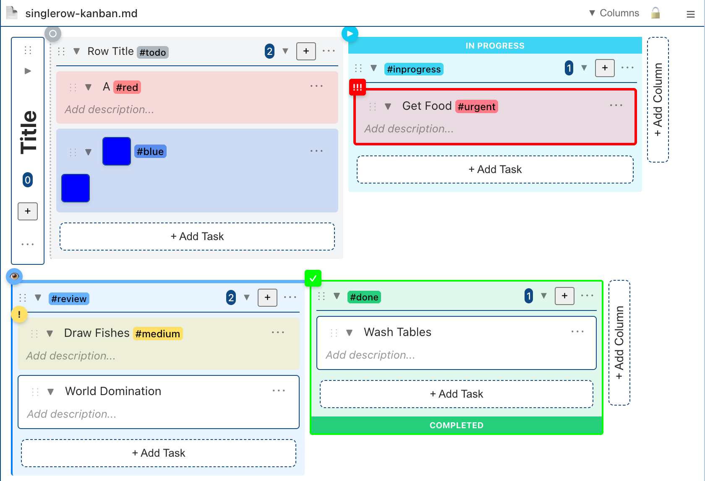

# Kanban Markdown for Visual Studio Code & VSCodium

A VS Code extension that allows editing Markdown files as an interactive Kanban board. Its made to mimic the functionality of a obsidian markdown editor which allows data handling and link management in kanban format. Using the tags it's more versatile. It should be data compatible with the Kanban Obsidian Markdown format from https://github.com/mgmeyers/obsidian-kanban .

## Features

### Basic Features

- **Markdown Parsing**: Automatically parses task lists from Markdown files.
- **Kanban View**: Displays tasks in a Kanban board format with multi-column layout.
- **Drag & Drop**: Supports dragging and dropping tasks between different columns. Proper movement and displaying of card and column movements. however they seem to be placed on top/bottom incoherently.
- **Real-time Sync**: Ensures real-time, two-way synchronization between the Kanban board and the Markdown file.
- **Undo & Redo**
- **Image & File dropping** creates new cards
- **Links** embeds images and allows links to other files. Path resolution is done relatively to file, secondly relatively to the opened workspace folders or absolute depending on the path.
- **Locking the file** so switching the md doesnt change the kaban view.
- **Tags** that color the columns and cards (if used in the title)
- **Folding** of cards, columns.

### Required Format

Requires a YAML header with 'kanban-plugin: board'
Add a H2 Title (Boards) and Tasks (Cards) below it.

```
---

kanban-plugin: board

---

## Title of Board
- [ ] Card
  Text of Card
- [ ] Next Card
  Content of Card
```

### Installation

1. Download the vsix and install

### How to Use

Press the "Kanban" button on the top right.
Add columns using the buttons.
Add cards using the buttons.

### Open Issues

Drag & Dropping Files from outside the editor doesnt create a correct path. Caused by https://github.com/microsoft/vscode-discussions/discussions/1663 

### Screenshot




## @ Tags and #gather\_ System Documentation

## Overview

The Markdown Kanban board supports advanced card organization using `@` tags and `#gather_` rules. This system allows automatic sorting and distribution of cards across columns based on tags and rules.

## @ Tags (Card Tags)

Cards can be tagged with `@` symbols to add metadata. Tags can appear in either the card title or description.

### Person Tags

Assign people to cards:

markdown

```
- [ ] Review PR @Reto
- [ ] Meeting preparation @Anita @Reto
```

### Date Tags

Add dates to cards. The first date tag of each type is recognized:

**Shorthand format** (assumes due date):

markdown

```
- [ ] Submit report @2025-03-27
- [ ] Review document @27-03-2025
```

**Typed format**:

markdown

```
- [ ] Task @due:2025-03-27
- [ ] Completed task @done:2025-03-26
- [ ] Project @start:2025-03-01 @end:2025-04-01
```

Supported date types: `due`, `done`, `modified`, `start`, `end`

### Sticky Tag

Prevents a card from being moved during sorting:

markdown

```
- [ ] Important task @sticky
```

## #gather\_ Rules (Column Tags)

Column headers can contain `#gather_` tags to automatically collect cards matching specific criteria when the sort button is pressed.

### Basic Syntax

markdown

```
## To Do #gather_Reto
## This Week #gather_day<7
## Urgent #gather_priority
```

### Operators

| Operator | Description | Example |
| --- | --- | --- |
| `&` | AND (all conditions must match) | `#gather_Reto&day<3` |
| `\|` | OR (any condition matches) | `#gather_Reto\|Anita` |
| `=` | EQUAL | `#gather_day=0` (today) |
| `!=` | NOT EQUAL | `#gather_weekday!=2` (not Tuesday) |
| `<` | LESS THAN | `#gather_day<7` (within 7 days) |
| `>` | GREATER THAN | `#gather_day>0` (future dates) |
| `!` | NOT (negates expression) | `#gather_!Reto` (not assigned to Reto) |

### Date Properties

| Property | Description | Values |
| --- | --- | --- |
| `day` or `dayoffset` | Days from today | ..., -2, -1, 0, 1, 2, ... |
| `weekday` | Day name | mon, tue, wed, thu, fri, sat, sun |
| `weekdaynum` | Day number | 1 (Mon) to 7 (Sun) |
| `month` | Month name | jan, feb, mar, ... dec |
| `monthnum` | Month number | 1 to 12 |

## Examples

### Simple Person Gathering

markdown

```
## Reto's Tasks #gather_Reto
```

Collects all cards with `@Reto`

### Multiple People

markdown

```
## Team Tasks #gather_Reto|Anita|John
```

Collects cards with `@Reto` OR `@Anita` OR `@John`

### Today's Tasks

markdown

```
## Today #gather_day=0
```

Collects cards with today's date

### This Week

markdown

```
## This Week #gather_day>=0&day<7
```

Collects cards dated from today through next 6 days

### Complex Rules

markdown

```
## Urgent This Week #gather_day>0&day<7&weekday!=sat&weekday!=sun
```

Collects cards due in the next 7 days, excluding weekends

### Combined Person and Date

markdown

```
## Reto This Week #gather_Reto&day<7
```

Collects cards assigned to Reto that are due within 7 days

### Next Week's Mondays

markdown

```
## Monday Tasks #gather_weekday=mon&day>0&day<14
```

Collects tasks on Mondays in the next two weeks

## Special Tags

### #ungathered

A fallback that collects all cards with @ tags that didn't match any gather rule:

markdown

```
## Unassigned #ungathered
```

**Important**: `#ungathered` is always processed LAST, regardless of column position. It only catches cards with @ tags that weren't matched by any `#gather_` rule.

### #sort-bydate and #sort-byname

Sort cards within a column:

markdown

```
## This Week #gather_day<7 #sort-bydate
## Team Tasks #gather_Reto|Anita #sort-byname
```

## Sorting Process

When you press the Sort button:

1.  **Sticky cards** stay in place (marked with `@sticky`)
2.  **Regular gather rules** are processed in column order (left to right)
    *   Each card is checked against all rules
    *   First matching rule wins
    *   Card moves to that column
3.  **Ungathered rule** processes remaining cards with @ tags
4.  **Unmatched cards** stay in their original columns
5.  **Sort rules** are applied within each column

## Advanced Examples

### Project Dashboard

markdown

```
## Overdue #gather_day<0 #sort-bydate
## Today #gather_day=0
## This Week #gather_day>0&day<7 #sort-bydate
## Next Week #gather_day>=7&day<14 #sort-bydate
## Reto #gather_Reto&day>=14
## Anita #gather_Anita&day>=14
## Backlog #ungathered
```

### Sprint Board

markdown

```
## Monday #gather_weekday=mon&day>=0&day<7
## Tuesday #gather_weekday=tue&day>=0&day<7
## Wednesday #gather_weekday=wed&day>=0&day<7
## Thursday #gather_weekday=thu&day>=0&day<7
## Friday #gather_weekday=fri&day>=0&day<7
## Unscheduled #ungathered
```

### Priority System

markdown

```
## Critical Today #gather_priority&day=0
## Urgent This Week #gather_urgent&day<7
## Normal #gather_!priority&!urgent
## Backlog #ungathered
```

## Tips

1.  **Order matters**: Place columns with more specific rules first
2.  **First match wins**: Once a card matches a rule, it stops checking
3.  **Use @sticky**: Keep important cards in place during sorting
4.  **Combine operators**: Create complex rules with & and |
5.  **Test incrementally**: Start with simple rules and add complexity

## Notes

*   Date comparisons use the system's local time
*   European date format (DD-MM-YYYY) is automatically converted
*   Cards without any @ tags are never moved by gather rules
*   Multiple gather rules in one column are combined with OR


