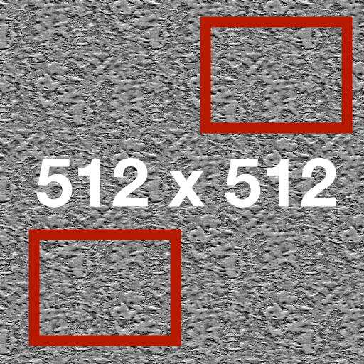

---

kanban-plugin: board

---

## taskinclude
- [ ] !!!taskinclude(markdown-include-2.md)!!!

## column without include #stack
- [ ] ./folder with space/image.png
  ~~~~ 
  
  Modify me 6

## !!!columninclude(markdown-presentation-a.md)!!! #urgent

## standard include #stack
- [ ] root/include.md
  !!!include(./root/include.md)!!!

